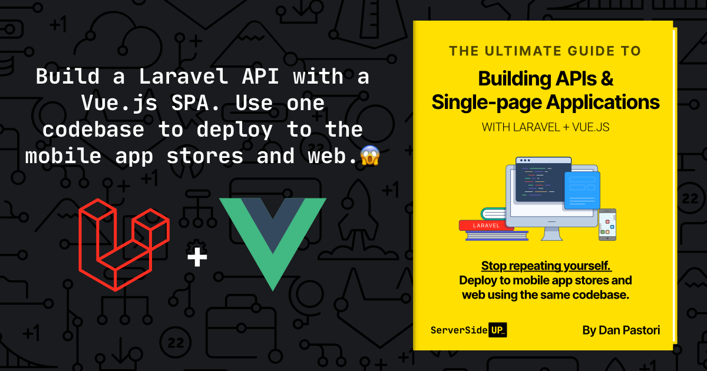

# 👋 Hello! My name is Jay Rogers.

## About me
I’m a DevOps engineer who accidentally ended up in application & user-experience design. 🤖🎨 

I’ve been working for myself since 2007. All of my businesses have been “bootstrapped", which means I grew the companies without any outside funding. I embrace these constraints to make myself more creative. 🤵

## I love helping other developers make awesome products
My friend [@danpastori](https://github.com/danpastori) started a company called [521 Dimensions](https://521dimensions.com) back in 2011. We
kept the company to just us two since we started. This forced us to learn how to develop software efficiently.

We created a blog called [Server Side Up](https://serversideup.net) where we share our experiences with other developers: 

## What I am working on now
Since [@danpastori](https://github.com/danpastori) and I are just a two person operation, we had to learn an efficient way to write web applications and deploy apps into the app stores.

We were able to figure out a way to:
* Build a [Laravel](https://laravel.com/) JSON API
* Create a [Vue.js](https://vuejs.org/) web front-end
* Generate iOS and Android Apps with [CapacitorJS](https://capacitorjs.com/)
* **All from the same codebase 😱** 

#### We're sharing our experiences in our upcoming book

## I do a lot more than sit at a keyboard all day...

💁 I married my college sweetheart
🐶 I'm a Dog Dad
🚴‍ I have a goal to bike over 1,000 miles every year
🗺 I’ve become addicted to traveling
🎧 I absolutely love discovering and sharing new music
✈️ I am currently planning my steps to become a private pilot
🏄‍ I was on a national champion waterskiing team for 14 years
❄️ I’ve snowmobiled more than 20,000 miles across the US
🤓 I enjoy hours-long conversations about history

## Let's stay in touch!

